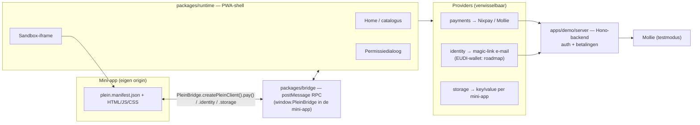

# OpenPlein

**OpenPlein ("Plein")** is an open-source mini-app platform for NL/EU: a single
runtime ("super-app") in which European services and products run as
sandboxed mini-apps — the WeChat model, but sovereign, open source and built
on European building blocks (Nixpay for payments today; Matrix and an EUDI
wallet identity provider are on the roadmap). An initiative of
[Sovereign AI Grid](https://sovereignaigrid.nl), with [Nixpay](https://nixpay.eu)
as founding payment provider. `packages/runtime` and `packages/bridge` are
AGPL-3.0; `packages/sdk` (manifest schema, types, scaffolder) is MIT so
mini-app builders aren't touched by the AGPL. See
[`docs/miniapp-spec.md`](docs/miniapp-spec.md) for the mini-app spec and
[`GOVERNANCE.md`](GOVERNANCE.md) for how the project is run.

---

*Vanaf hier in het Nederlands.*

## Wat is OpenPlein

OpenPlein is een open-source mini-app-platform voor NL/EU: **jouw diensten,
één Plein**. Eén runtime (de "shell", een installeerbare PWA) waarin
Europese diensten en producten als mini-apps draaien — elk in een
gesandboxte iframe, elk pratend met de shell via een getypeerde bridge-API.
Geen eigen betaalinfrastructuur, geen eigen chat-protocol: OpenPlein
componeert bestaande Europese bouwstenen (Nixpay voor betalen, straks Matrix
en een EUDI-wallet voor identiteit) in plaats van ze zelf te bouwen.

Zie [`docs/superpowers/specs/2026-07-27-openplein-design.md`](docs/superpowers/specs/2026-07-27-openplein-design.md)
voor het volledige ontwerp en de fasering.

## Architectuur



De mini-app ziet nooit de shell of andere mini-apps: de iframe draait zonder
`allow-same-origin`, en alle bridge-calls lopen via `postMessage` met
strikte origin-checks aan beide kanten. Zie
[`docs/miniapp-spec.md`](docs/miniapp-spec.md) voor de volledige spec.

## Quickstart

Vereist: Node 20 (zie `.nvmrc`), pnpm.

```bash
pnpm install
```

Start daarna drie dev-servers, elk in een eigen terminal:

```bash
# 1. Backend: auth (magic-link) + betalingen (Mollie-mock)
PAYMENTS_MOCK=1 pnpm --filter @openplein/demo-server dev

# 2. De twee demo-mini-apps (statische servers)
pnpm --filter @openplein/demo-miniapps dev:lijstje    # http://localhost:5180
pnpm --filter @openplein/demo-miniapps dev:betalen    # http://localhost:5181

# 3. De shell zelf
pnpm --filter @openplein/runtime dev                  # http://localhost:5173
```

Open `http://localhost:5173`, vul een e-mailadres in en kijk in de stdout
van terminal 1 (`[plein-auth] code voor ...: ######`) voor de inlogcode —
er wordt in dev geen mail verstuurd. Na het inloggen open je "Lijstje"
(identity + storage) of "Betaal-demo" (Nixpay/Mollie-testcheckout, opent in
een nieuw tabblad — geblokkeerde popups vallen terug op een banner met een
directe link).

Elke mini-app laadt `plein-client.js`, een IIFE-bundel van `@openplein/bridge`
die het globale `window.PleinBridge` (en daarmee `PleinBridge.createPleinClient()`)
levert. Bouw hem opnieuw met:

```bash
pnpm --filter @openplein/bridge build:client
```

Een nieuwe mini-app scaffold je met de `create-plein-app`-CLI uit de sdk
(bin gebouwd via het `prepare`-script van `packages/sdk` bij `pnpm install`,
naar `packages/sdk/dist/create-plein-app.mjs`):

```bash
node packages/sdk/dist/create-plein-app.mjs mijn-app
```

(`pnpm --filter @openplein/sdk exec create-plein-app` werkt hier bewust
niet: pnpm linkt het `bin` van een package niet in zijn eigen
`node_modules/.bin`. Vanuit een package dat `@openplein/sdk` als
dependency heeft — zoals `packages/runtime` — kan wél
`pnpm --filter @openplein/runtime exec create-plein-app mijn-app`.)

## Testen

```bash
pnpm test                                  # unit-tests (vitest, alle packages)
pnpm --filter @openplein/e2e test          # end-to-end (Playwright): login → mini-app → permissies → betaling + sandbox-escape-checks
```

## Licenties

| Package | Licentie |
|---|---|
| `packages/runtime` | AGPL-3.0-only |
| `packages/bridge` | AGPL-3.0-only |
| `packages/sdk` | MIT |

De AGPL geldt voor de shell en de bridge zelf; mini-apps die tegen de bridge
praten (zoals de demo's in `apps/demo/miniapps`) zijn eigen, onafhankelijke
werken en vallen niet onder de AGPL van de runtime.

## Documentatie

- [`docs/miniapp-spec.md`](docs/miniapp-spec.md) — manifest, bridge-API, permissiemodel, sandbox-eisen, roadmap
- [`GOVERNANCE.md`](GOVERNANCE.md) — maintainerschap, besluitvorming, bijdragen
- [`docs/funding/README.md`](docs/funding/README.md) — NGI Zero Commons Fund-aanvraagskelet
- [`docs/superpowers/specs/2026-07-27-openplein-design.md`](docs/superpowers/specs/2026-07-27-openplein-design.md) — ontwerp en fasering

## Attributie

Een initiatief van Sovereign AI Grid — founding payment provider: Nixpay.
